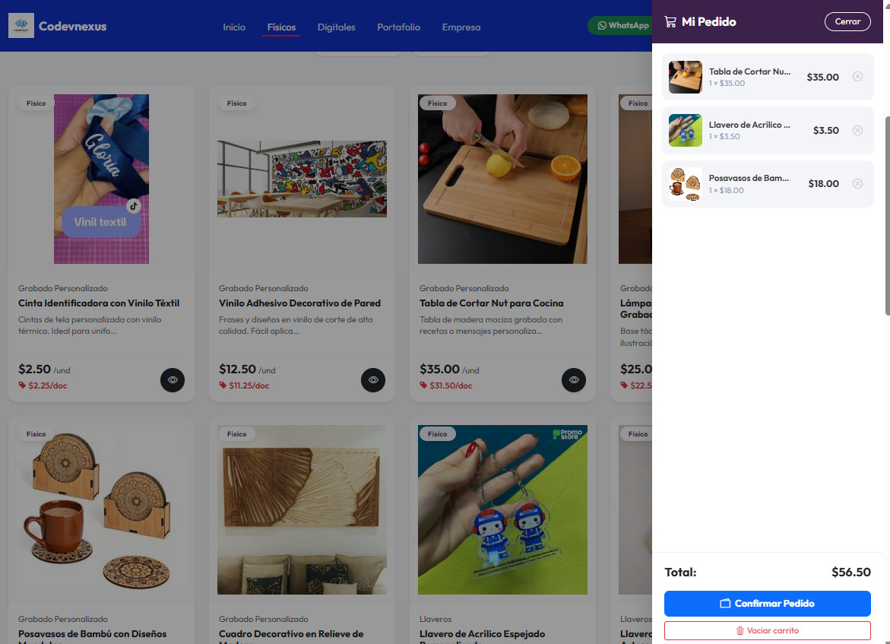
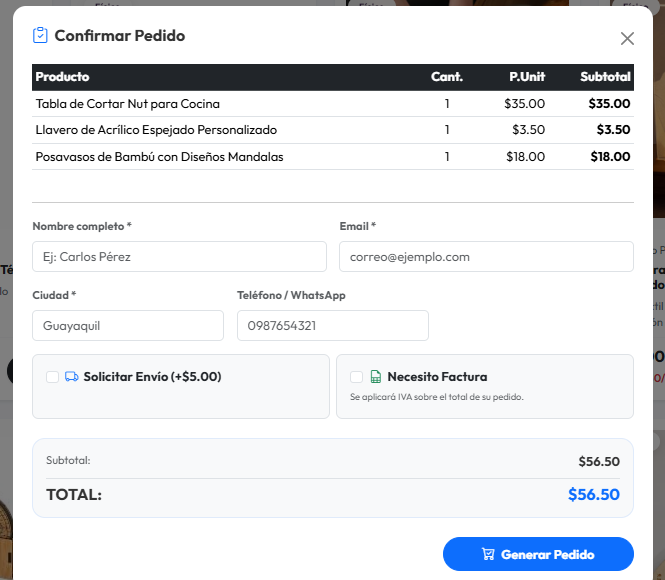
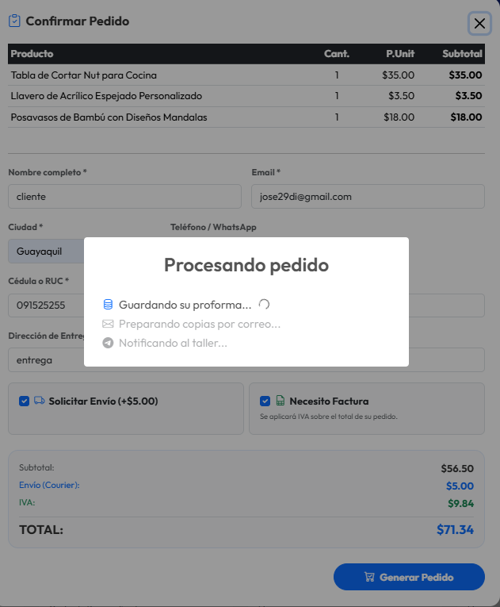
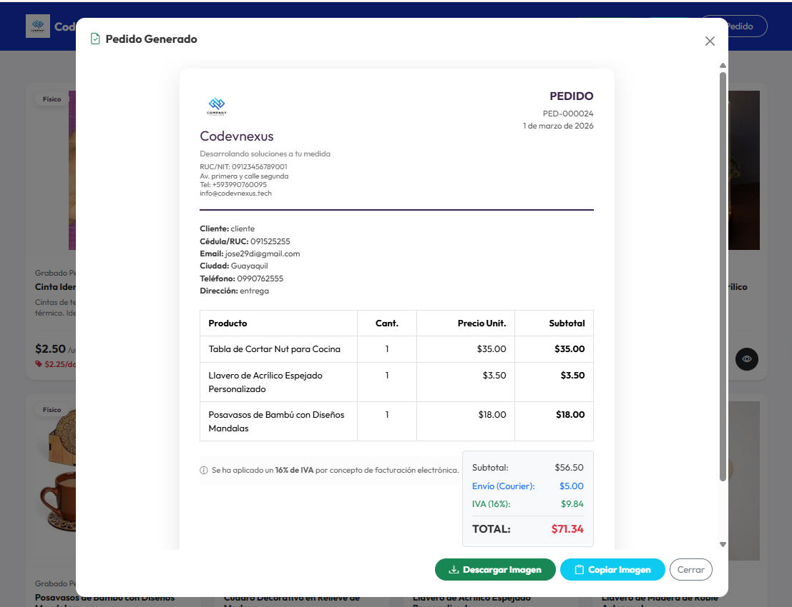
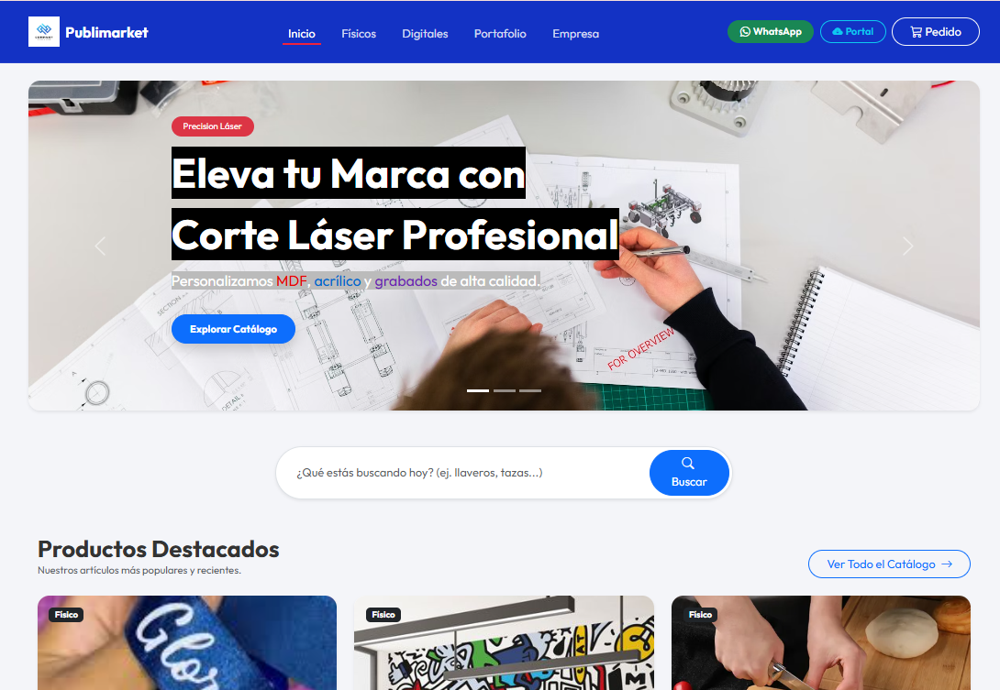
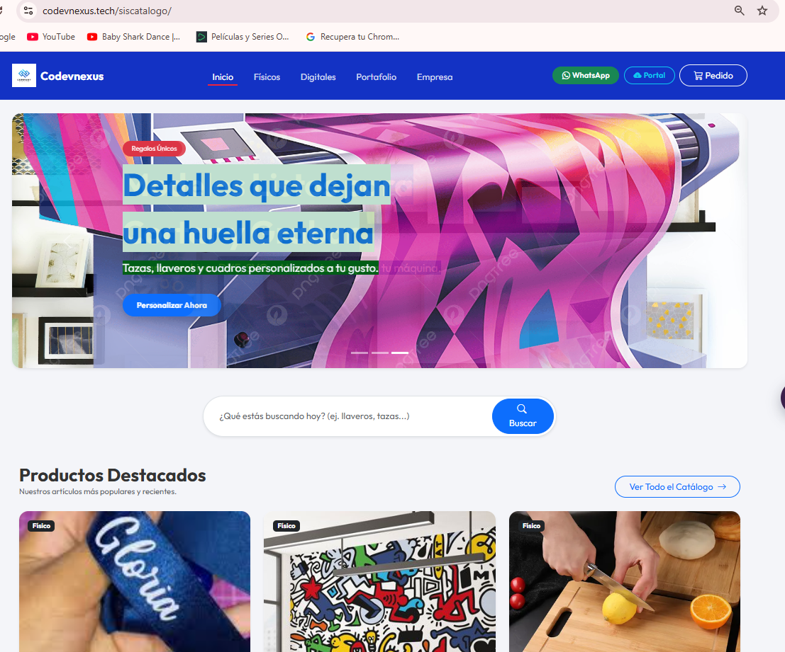
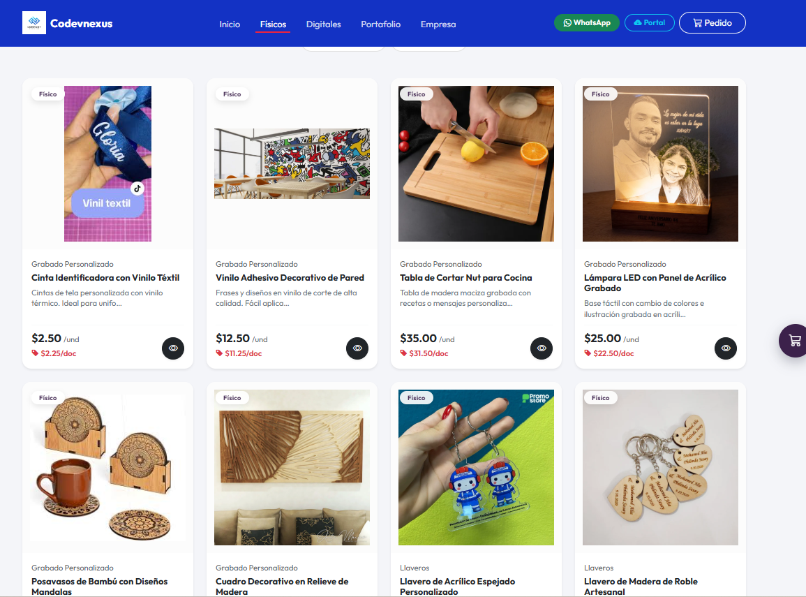
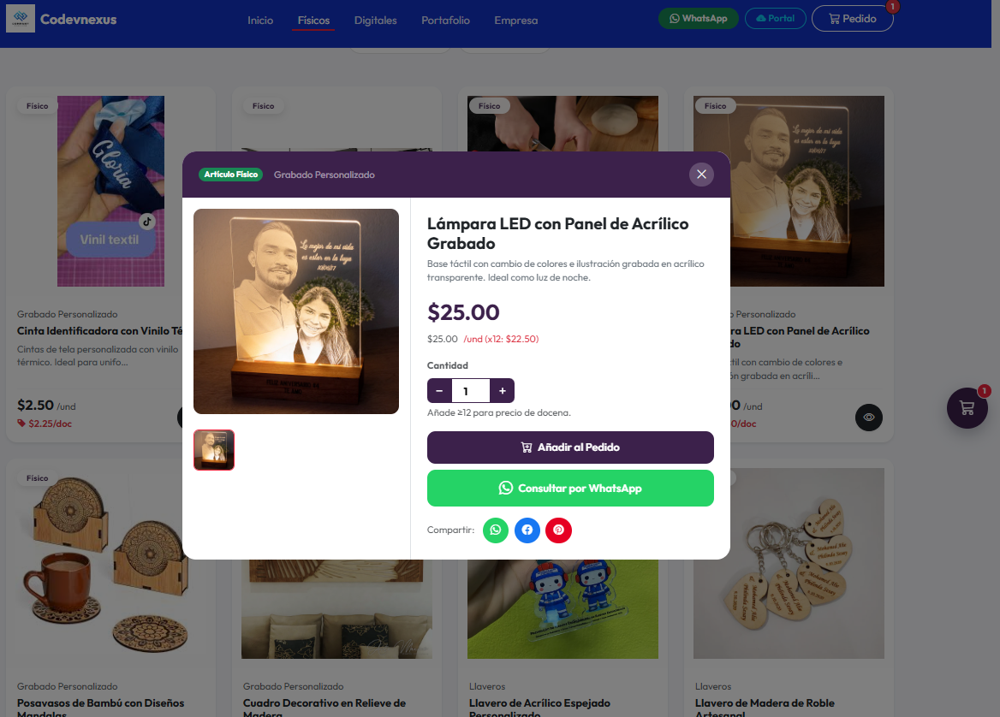

# 📦 SisCatalogo - Plataforma de Gestión de Catálogo e Inventario B2B

🚀 **Demo disponible en:** [https://codevnexus.tech/siscatalogo/](https://codevnexus.tech/siscatalogo/)

---

SisCatalogo es un robusto sistema web construido en PHP moderno, optimizado para gestionar catálogos de productos, controlar existencias e inventarios, y generar o recibir cotizaciones estructuradas y pedidos en línea desde dispositivos móviles y de escritorio. El sistema incluye un Catálogo Público Inteligente y un Panel de Administración avanzado (BackOffice).


---

## ✨ Características Principales

### 🛒 Catálogo Público (Para Clientes)
- **Carrito de Cotizaciones/Compras:** Añade productos al instante con un panel lateral accesible y moderno.
- **Diseño 100% Mobile-First:** Interfaz optimizada para navegar desde smartphones y compartir productos de forma fluida.
- **Zoom de Imágenes Pro:** Sistema envolvente (Glassmorphism) para previsualizar detalles de productos en alta resolución.
- **Exportación Nativa Automática:** Los clientes pueden descargar sus proformas directamente en **PDF** o formato **Imagen (PNG)**.
- **Consultas por WhatsApp:** Enlaces directos para consultas rápidas y opción de compartir productos fácilmente.
- **Control de Stock en Tiempo Real:** Advertencias dinámicas que evitan pedidos superiores a las existencias disponibles.
- **Entregas Digitales:** Soporte para productos descargables (vectores, archivos de corte) con gestión de accesos seguros.

### 🔐 Panel de Administración (BackOffice)
- **Dashboard Dinámico:** Indicadores clave de rendimiento, resumen de pedidos recientes y control de visitas.
- **Gestión Granular de Pedidos:** Aprobación, revisión y edición total de cotizaciones. Control automático de IVA y cargos de envío.
- **Notificaciones por Telegram Bot:** Alertas instantáneas en tiempo real al administrador por cada nuevo pedido recibido.
- **Confirmación por Email:** Envío automático de copias del pedido tanto al **Admin** (para control) como al **Cliente** (como respaldo).
- **Sistema RBAC Pro:** Control de acceso basado en roles con más de 30 permisos específicos para máxima seguridad.
- **Perfil de Empresa Maestro:** Configuración centralizada de datos fiscales, logotipos (Locales o vía ImgBB) y redes sociales.
- **Personalizador de Temas Visual:** Cambia los colores de la interfaz (Navbar, Footer, Botones) sin tocar una sola línea de código.
- **Bitácora de Seguridad:** Auditoría completa de todas las acciones realizadas por los administradores en el sistema.

---

## 🛠️ Requisitos Técnicos
- **Servidor Web:** Apache / Nginx (Probado en Laragon, XAMPP y cPanel).
- **PHP:** Versión 8.1 o superior.
- **Motor SQL:** MySQL 5.7+ / MariaDB 10.4+.
- **Extensiones PHP:** `pdo_mysql`, `gd`, `zip`, `mbstring`, `cURL`.

---

## 📂 Estructura del Proyecto (MVC)
```text
siscatalogo/
├── app/                # Lógica central (Controladores, Modelos, Núcleo)
├── config/             # Configuración global del sistema
├── database/           # Archivos SQL (Esquemas y Datos Iniciales)
├── public/             # Punto de entrada único y recursos estáticos
│   ├── assets/         # CSS, JS y librerías de interfaz
│   └── install.php     # Asistente de instalación automática
└── storage/            # Almacenamiento local de archivos y catálogos
```

---

## 🚀 Pasos de Instalación Rápida

1.  **Carga de Archivos:** Sube el código al directorio raíz de tu servidor (ejemplo: `/public_html` o `/htdocs`).
2.  **Ejecutar Instalador:** Accede desde tu navegador a: `http://tudominio.com/install.php`.
3.  **Configuración Automática:**
    *   Ingresa las credenciales de tu base de datos MySQL.
    *   Define la URL base de tu sitio.
    *   Selecciona si deseas una **Instalación Limpia** o con **Datos de Prueba**.
4.  **Finalización:** Por seguridad, **ELIMINA** el archivo `public/install.php` después de terminar.

### Accesos Predeterminados:
*   **Administrador:** Usuario: `admin` | Contraseña: `admin123`
*   **Demo:** Usuario: `demo` | Contraseña: `demo1234`
*   **Enlace Admin:** `http://tudominio.com/syslogin`

---

## ☁️ Integraciones Externas
*   **Telegram API:** Crea un bot en `@BotFather` para recibir alertas push.
*   **SMTP Email:** Configura tu correo institucional en el panel para envíos automáticos.
*   **ImgBB CDN:** Habilita el alojamiento de imágenes externo para optimizar la carga.

---
*Diseñado para potenciar la productividad y la identidad visual de tu marca.*

## 📸 Diseños del sistema









